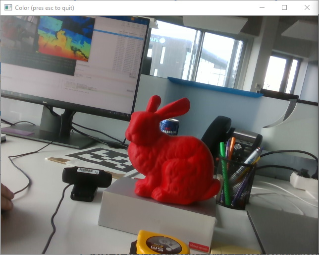
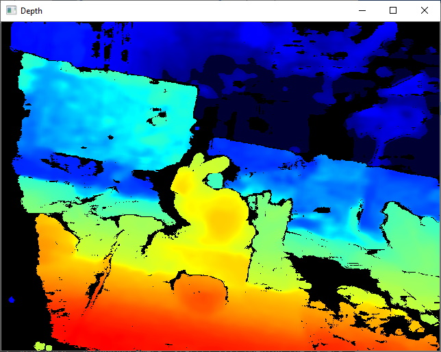

SolARModuleRealSense
=============

*SolAR is an open-source framework released under Apache license 2.0 making possible to easily create your own camera pose estimation solution to develop Augmented Reality applications. 
SolAR is dedicated to Augmented Reality (AR).
It offers a C++ SDK to easily and quickly develop and use custom solutions for camera pose estimation. It provides developers with a full chain from low-level vision components development to camera pose estimation pipelines and AR service development.*

The **SolAR Module RealSense** is a module to use [ Intel® RealSense™](https://www.intelrealsense.com/) depth sensors throught his [RealSense SDK](https://www.intelrealsense.com/sdk-2/). Intel® RealSense™ technologies offer a variety of vision‑based solutions designed to understand the world in 3D.

**/!\ Only available on Windows, thirdparties for Linux will be soon deployed. Otherwise you can already check [RealSense linux distribution](https://github.com/IntelRealSense/librealsense/blob/master/doc/distribution_linux.md)**
## Tests
### SolARTestRealSenseRGBDCamera
To test IRGBD interface

|  |  | 
|:-:|:-:|
| RGB | 2D Depth Map |